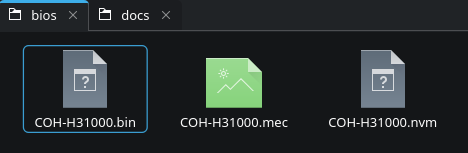
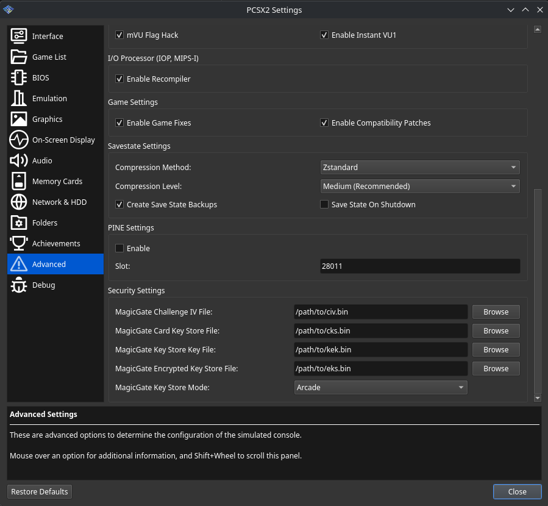
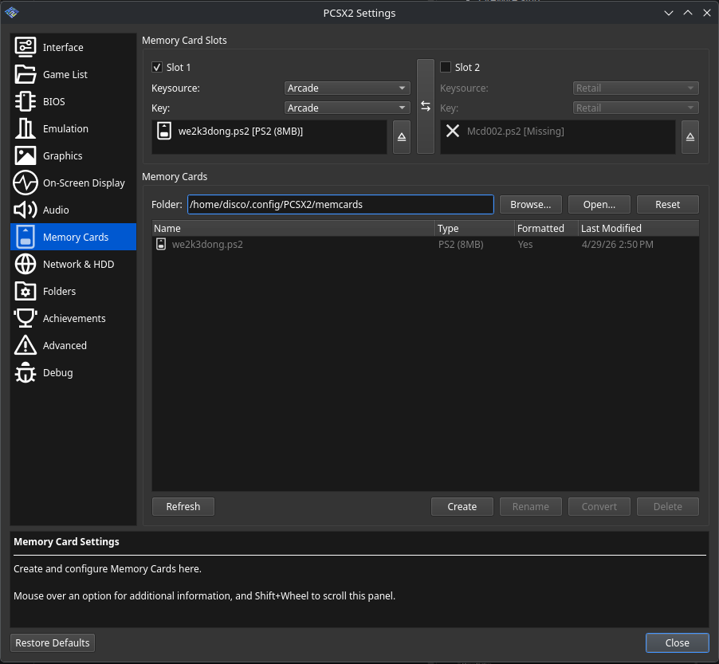
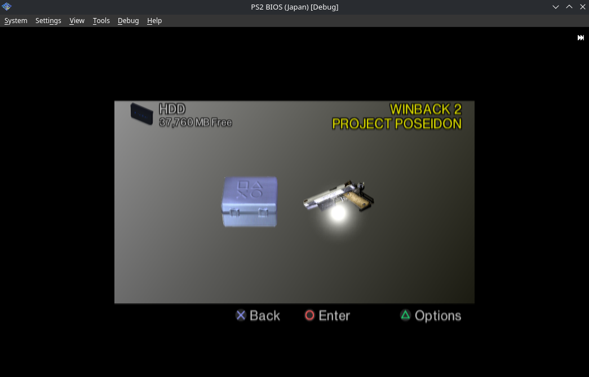

# PCSX2 Reliquary

PCSX2 Reliquary is an experimental fork of [PCSX2](https://github.com/PCSX2/pcsx2) focused on properly modeling security flows, PlayStation 2 arcade hardware, and accuracy focused compatibility work.

<!-- TOC -->
* [Feature overview](#feature-overview)
* [Getting started](#getting-started)
* [Required dumps and device data](#required-dumps-and-device-data)
* [BIOS and security configuration](#bios-and-security-configuration)
* [Mechacon Key material](#mechacon-key-material)
* [Memory-card authentication](#memory-card-authentication)
* [Konami Python Game Files](#konami-python-game-files)
* [HDD, CF, and CHD overlays](#hdd-cf-and-chd-overlays)
* [Accurate soft-float](#accurate-soft-float)
* [paraLLEl-GS](#parallel-gs)
* [Retail and utility media](#retail-and-utility-media)
* [Upstream and license](#upstream-and-license)
<!-- TOC -->

## Feature overview

| Feature                               | Description                                                                                                                                          |
|---------------------------------------|------------------------------------------------------------------------------------------------------------------------------------------------------|
| Retail PS2 emulation                  | Synced monthly with upstream PCSX2                                                                                                                   |
| Accurate soft-float recompiler        | Optional EE FPU, VU0, and VU1 soft-float recompilers                                                                                                 |
| ParaLLEl-GS                           | Experimental Vulkan-based GS renderer with supersampling and analog-display emulation, targeting software renderer accuracy                          |
| Low-Latency Audio                     | New low latency sync mode, WASAPI Exclusive and WASAPI IAudioClient3 drivers. Support for sub-frame audio latency ~10ms.                             |
| Optional Mechacon security paths      | Selectable retail, development, prototype, and arcade key-store modes, skipped if not provided                                                       |
| DVD Player Support                    | Requires properly setup mechacon keys, NVRAM and ROM1 dump                                                                                           |
| CUE File Support                      | Prioritize CUE in game list over BIN. Allows proper loading of titles dependent on CUE files as well as music CD playback                            |
| HDD Install Disks and Game Installs   | Requires properly setup mechacon keys as well as valid NVRAM and Mech Version file                                                                   |
| FireWire integration                  | Foundational FireWire emulation unlocks titles relying on initalization                                                                              |
| Konami Python 1                       | `.py1` game entries, P1IO/FireWire emulation, HDD/CF media, dongles, and memory card authentication                                                  |
| Konami Python 2                       | `.py2` game entries, P2IO emulation, HDD security, dongles, e-amuse cards, and game-specific configuration                                           |
| BTools ddrio.dll and minimaid support | Bring your own `ddrio.dll` or `mmmagic64.dll` for Python 2 DDR titles for real hardware IO support on boards like [Snek](https://icedragon.io/snek/) |
| CHD-backed HDD and CF media           | Full CHD image support for HDD and CF card images                                                                                                    |

## Getting started

Check the fork's [Releases page](https://github.com/DiscoStarslayer/pcsx2/releases) for published packages. Reliquary uses the same general setup as upstream PCSX2, with additional BIOS and security configuration described below.

For Konami Python 1 titles, ensure an arcade BIOS dump is configured and provided in the BIOS selection menu.

## Required dumps and device data

The exact files depend on the target system.

| Data                                             | Used for                                                              | Required Retail | Required Python 1 | Required Python 2 |
|--------------------------------------------------|-----------------------------------------------------------------------|-----------------|-------------------|-------------------|
| BIOS ROM                                         | Device and game boot, initial IRX load                                | YES             | YES               | YES               |
| NVRAM, MEC file                                  | Console identity, region data, i.Link identity, and mechacon behavior | NO              | YES               | YES               |
| MG Keys                                          | DNAs, Memory card auth, hdd KELF signing and verification             | NO              | YES               | YES               |
| HDD ID                                           | DNAs HDD-bound authentication, can be null for fresh installs         | NO              | NO                | YES               |
| P1IO board boot ROM, config ROM, BBSRAM          | Python 1 P1IO behavior and board state                                | NO              | YES               | NO                |
| Internal, external, black, and white dongle data | Game, network and IO board auth                                       | NO              | YES               | YES               |
| Memory card ID                                   | Boot dongles, COH cards, card authentication                          | NO              | YES               | NO                |
| Player card IDs                                  | E-amuse card input                                                    | NO              | YES               | YES               |

## BIOS and security configuration

For full system emulation, use a complete BIOS dump rather than only a ROM image. Place the BIOS ROM and its matching `.nvm`, `.mec`, `.rom1`, and optionally `.rom2` files in the BIOS directory with the same base filename:

```text
SCPH-xxxxx.rom0
SCPH-xxxxx.nvm
SCPH-xxxxx.mec
SCPH-xxxxx.rom1
SCPH-xxxxx.rom2
```

The NVRAM contains console-specific data, including the i.Link ID, while the MEC file identifies the mechacon version. Reliquary can create fallback data when companion files are absent, but generated values are not a substitute for matching hardware data when a security flow validates console identity. [BIOSDrain](https://github.com/F0bes/biosdrain) can be used to dump a console BIOS.



Reliquary provides separate **Retail BIOS** and **Arcade BIOS** selectors. Python 1 games load the arcade BIOS and fall back to the retail BIOS if missing. Python 2 entries use the retail BIOS path.

## Mechacon Key material

Configure the following under **Settings > Advanced > Security Settings**:

| Setting                           | Conventional filename | Purpose                                     |
|-----------------------------------|-----------------------|---------------------------------------------|
| Mechacon Challenge IV File        | `civ.bin`             | Challenge initialization data               |
| Mechacon Card Key Store File      | `cks.bin`             | Card key-store data                         |
| Mechacon Key Store Key File       | `kek.bin`             | Key used to process the encrypted key store |
| Mechacon Encrypted Key Store File | `eks.bin`             | Encrypted mechacon key-store data           |

All four are required for Python 2 and any authenticated paths on retail. If not provided, will operate in fallback mode which should be enough for retail titles to continue saving.

**Arcade KELF Override KBIT** and **Arcade KELF Override KC** files are required only for Python 1 arcade KELFs.



The **Mechacon Key Store Mode** selects the key family exposed by the mechacon path:

| Mode      | Intended path          |
|-----------|------------------------|
| Dev       | Dev devices like TOOL  |
| Retail    | Retail and Python 2    |
| Prototype | Unknown                |
| Arcade    | COH hardware, Python 1 |

This selection only really applies to Retail titles. Loading a Python 1 title automatically sets this to Arcade mode. Loading a Python 2 title automatically sets Retail.

**Reliquary includes a fallback for basic retail memory-card behavior when keys are not configured.**

## Memory-card authentication

Each memory-card slot can select its image, key source, and authentication key independently. **Key Source** and **Key** are separate settings:



Reliquary supports raw PS2 memory-card images with their spare/ECC data. Some dumping tools omit ECC bytes; those images must be converted with something like [PS2 ECC Memory Card Converter](https://github.com/ffgriever-pl/PS2-ECC-Memory-Card-Converter).

## Konami Python Game Files

Reliquary recognizes `.py1` and `.py2` files as games and can boot them directly when provided as a target over CLI. Relative paths are recommended and are resolved from the `.py` file's directory.

See the following pages for more details:

- [Konami Python 1 game-entry reference](docs/python1.md)
- [Konami Python 2 game-entry reference](docs/python2.md)

## HDD, CF, and CHD overlays

HDD and CF images can be loaded as read-only CHDs. Writes made by the game are stored in an overlay under `hdd-overlays/` in the Reliquary data directory.

## Accurate soft-float

The PlayStation 2's floating-point units do not behave exactly like standard IEEE-754. Reliquary provides independent software-emulation options for the EE FPU, VU0, and VU1 to attempt to accurately represent the PS2 quirks at reasonable performance.

The options are under **Settings > Advanced**:


All three are disabled by default and can be enabled per game. While some games have quite obvious issues around proper float emulation (Stuntman, Driv3r), floating point applies to many parts of a title. Physics, rendering or lighting can be noticeably improved with soft-float.

The optimized soft-float recompilers can use AVX2.

**EE** and **VU0** are generally the most impactful to enable and also the most reasonable to be able to run full speed on powerful enough hardware. **VU1** is generally required to resolve rendering issues and is significantly more expensive and generally scales by the complexity of the scene. Ideally you only enable **VU1** when required.

Most games do well with **Multi-Threaded VU** enabled, and **mVU FLag Hack** enabled for improved speed. **Instant VU1** tends to lower performance if **VU1** is in soft-float mode.

## paraLLEl-GS

Reliquary integrates [paraLLEl-GS](https://github.com/Arntzen-Software/parallel-gs), a Vulkan compute-shader implementation of the PlayStation 2 GS. It aims to combine software-renderer-style accuracy with GPU acceleration, supersampling, and analog-display emulation.

## Retail and utility media

Mechacon, memory card, DEV9, and DVD paths can be used to emulate tools like HDD Utility discs, Free McBoot, HDD installers, DNAs, DVD playback and updates.



## Upstream and license

Reliquary is based on [PCSX2](https://github.com/PCSX2/pcsx2) and continues to incorporate upstream emulator improvements. General PCSX2 documentation and project history remain available from the [PCSX2 website](https://pcsx2.net/) and upstream repository. **DO NOT BOTHER UPSTREAM MAINTAINERS WITH ISSUES ON THIS BRANCH.** All issues should be made against this branch and has nothing to do with upstream maintainers.

paraLLEl-GS was created by Hans-Kristian "themaister" Arntzen with contributions from Runar Heyer and other contributors. See the [paraLLEl-GS README](https://github.com/Arntzen-Software/parallel-gs).

PCSX2 Reliquary is distributed under the GNU General Public License version 3. See [COPYING.GPLv3](COPYING.GPLv3) for the license text.
